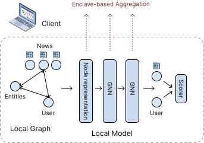

# GRAPHITEE

This repository contains the source code of _GRAPHITEE_, a federated graph learning
model for recommendations in a fully distributed setup.
The detailed publication can be found [here](./docs/MscThesis_EmilienDuc.pdf).

## Overview

GRAPHITEE is a federated graph learning-based recommendation framework that simultaneously addresses privacy, utility, and low resource requirements. GRAPHITEE enables privacy-preserving graph learning on fully decentralized user-item bipartite graphs while remaining resilient to the k-anonymity intersection attack we highlight and demonstrate against existing models. GRAPHITEE achieves comparable utility to state-of-the-art centralized and decentralized baselines on the real-world MIND news recommendation dataset. GRAPHITEE’s low computational, bandwidth, and storage requirements make it a viable solution to deploy on user devices, including mobile.

Our system’s core is a message-passing Graph Neural Network. Trained in the standard way, a GNN would be subject to the same attack we presented, resulting in
impractical communication costs. For this reason, we employ the Retexo training
strategy: a **layerwise** approach that ensures item representations are not updated
in every round, a critical feature that protects from intersection attacks. Instead of
having as many updates as there are rounds, we have as many updates as there are
layers: 3. Using Retexo further removes the communication between the clients in each training round, which is typical for training a GNN in a distributed setup. This reduces the communication costs by several orders of magnitude over standard GNN training in
the distributed setup.

Importantly, this means that **we train each layer of the model individually** and in order. Once a layer is fully trained, we freeze it and use its outputs as inputs to train the next one.

Finally, we use a Trusted Execution Environment (TEE) for secure aggregation instead of multi-party computation to further enhance our system’s privacy guarantees
and scalability. Using TEE reduces the time taken for aggregation and scales to thousands of users, unlike secure multi-party computation. It further ensures the user-item relationships are not revealed to the controller.

The setup of a client for the MIND News Recommendation Dataset can be seen in the figure below.

## Installation

This repository and the `main` branch contains all you need to run the code in the centralized setup,
you can simply follow the instructions below.
If you wish to reproduce our exepriments on AWS or any other distributed setup, you will need to use the code in
the [`aws-controller`](https://github.com/kisp-nus/GRAPHITEE/tree/aws-controller) and [`aws-client`](https://github.com/kisp-nus/GRAPHITEE/tree/aws-client) branches; while this sounds like a
lot of effort, there is nothing to be scared about; we made a detailed guide
[here](docs/distributed_setup_guide.md).

In order to run in the centralized setup, we encourage you to create a fresh
conda environment using python 3.10:

    cd GRAPHITEE

    conda create -n graphitee python=3.10
    conda activate graphitee

    pip install -r requirements.txt
    python main.py

    # if you have no GPU available, use
    python main.py device=cpu

If you already use torch 2.2.0 with cuda 12.1, you should be good to run it
directly in your native environment. Running with different versions is not guaranteed
to work (almost certain to fail) because DGL has strong dependencies; each DGL version
is usually compatible with only 1-2 torch versions.

All parameters are adjustable in the file `config/news_recommendation.yaml`.
The first run will inevitably take some time as the whole dataset needs to be
downloaded and processed. If you stopped the program while it was
processing the data for the first time, you might want to re-run it using the flag
`force_reload=true`.  _[WandB](https://wandb.ai)_ is enabled by default for online logs
and a nice representation of the data.

## Make it your own

The three elements at the core of _GRAPHITEE_ are GNNs, Enclaves, and the Retexo
training strategy. There are many different GNNs out there focused on
different recommendation tasks, using different information and different methods.
We encourage you to try to adapt your own GNN model to be used under the _GRAPHITEE_
framework and see how it performs. This codebase had been developed with the idea
that it should be as easy to integrate with existing GNN models as possible.

We explain here a 3-step quickstart guide to do so:

### 1: Define your model

The challenge to define a model under the Retexo training strategy is to **think layerwise**. We try to make it easy by offering an interface, `BaseModel.py` that
you can implement. If you have your model ready, your main challenge will be implementing the function `get_nth_layer` and an `IntermediateModel` class for your model.

We present an example by making our own version of the DivHGNN model in `models/DivGNN.py`. Differences with the original DivHGNN include using SAGE for message passing, no _words_ nodes, and no topological attributes.

### 2: Prepare the graph

We support MIND, Microsoft News Recommendation Dataset, and create our own graph with
_users_, _news_, and _entities_ nodes with BERT-encoded attributes. Models for advanced recommendation tasks, such as News Recommendations, often have
their own pre-processing and feature extraction protocols. You can therefore add your
own graph creation mechanism if it differs from ours.

### 3: Try it out!

Just try it out! See `trainer/news_trainer.py` for the complete training protocol,
simply replace it with your own model or create a new trainer if you want to make specific
changes. You might have to tweak some parameters; some things to consider are:

- Training Full-Graph instead of mini-batches usually requires many more epochs. Log your evaluation metrics on [WandB](https://wandb.ai) to check the convergence easily.
- Dimensions are a very important factor. At first, try to use the same number of dimensions for each layer.
- Try different learning rates and rate schedulers. In Full-Graph, this can
  have a massive impact on the performance.
